# 📌 Bugfix Pada Kode index.html

Dokumentasi ini berisi daftar bug yang ditemukan pada aplikasi serta perbaikan yang telah dilakukan untuk meningkatkan kualitas kode, tampilan, dan pengalaman pengguna.

## 🐞 Daftar Bug & Perbaikant

### 1. Bug Layout: Radio Button Tidak Tertata Dengan Benar

### Masalah

Semua elemen 'input' diberikan width: 100%, termasuk radio button. Hal ini menyebabkan radio button tampil tidak proporsional dan bergeser dari layout normal.

### Kode Bermasalah


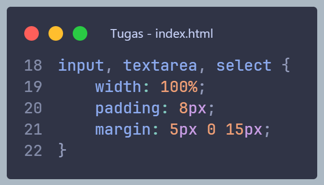

### Perbaikan

Pisahkan styling antara input teks dan radio button.

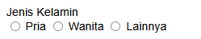

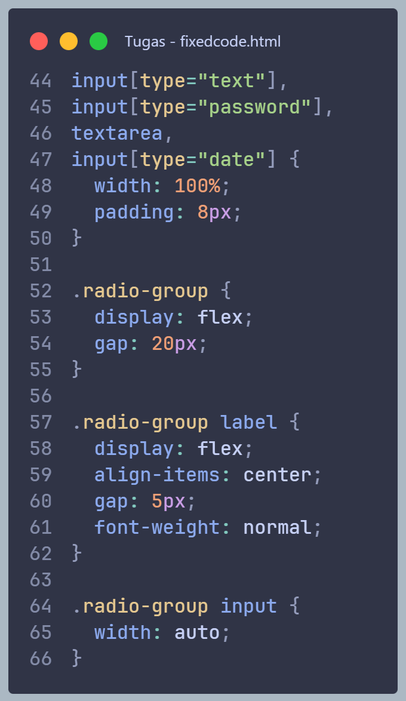

---

### 2. Bug Logika: Data Tidak Tersimpan Saat Refresh

### Masalah

Data hanya disimpan di DOM (tabel), sehingga akan hilang saat halaman di-refresh.

### Kode Bermasalah

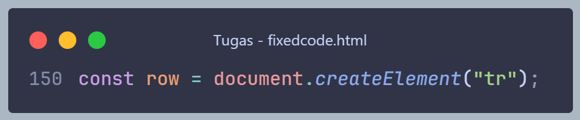

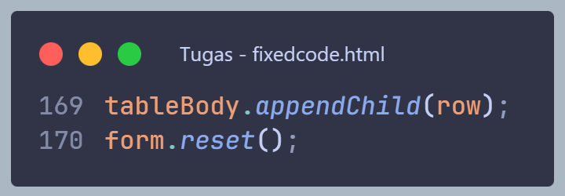

### Perbaikan

Gunakan _localStorage_ sebagai penyimpanan data.

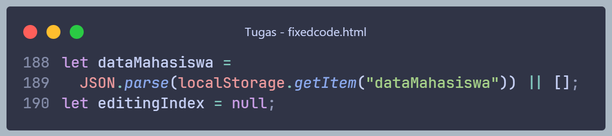

Tambahkan fungsi render

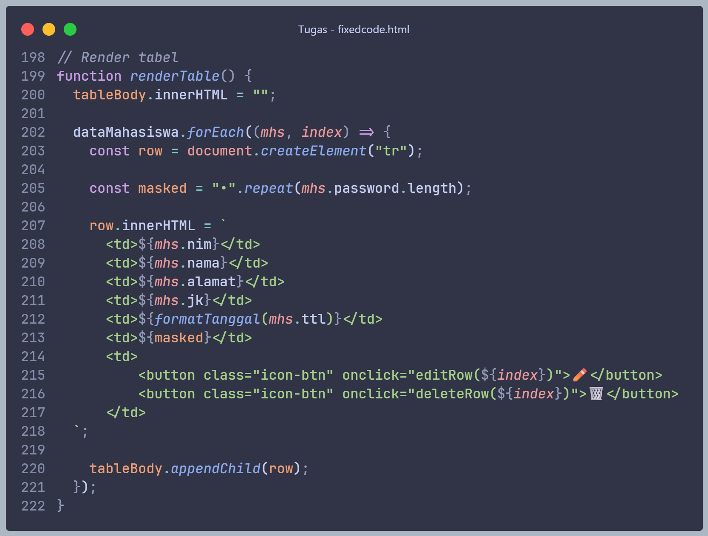

---

### 3. Bug Logika: Fitur Edit Tidak Lengkap

### Masalah

Fungsi edit hanya mengisi sebagian data (tidak termasuk jenis kelamin dan tanggal lahir).

### Kode Bermasalah

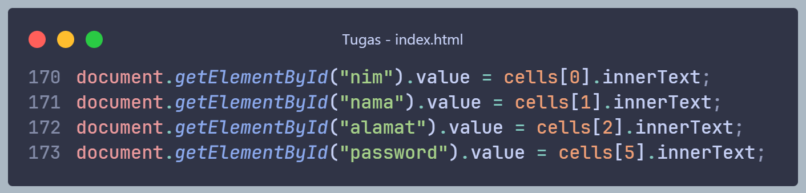

### Perbaikan

Tambahkan pengisian ulang untuk semua field.

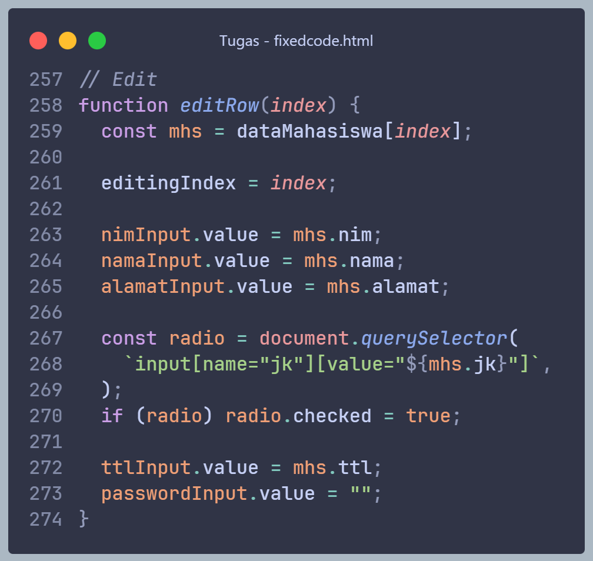

---

### 4. Bug UX: Mekanisme Edit Menghapus Data Lama

### Masalah

Data lama dihapus saat edit, kemudian dibuat ulang. Ini berisiko kehilangan data jika pengguna tidak menyimpan ulang.

### Kode Bermasalah

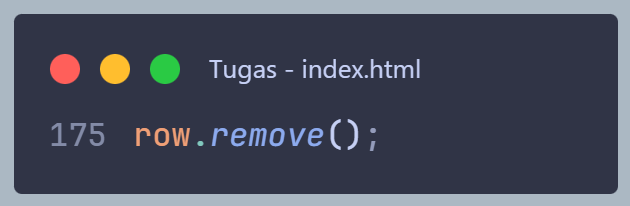

### Perbaikan

Gunakan mode edit dengan indeks data.

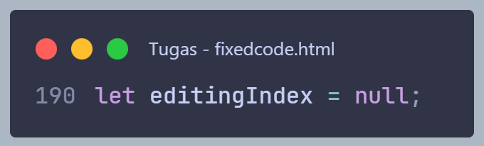
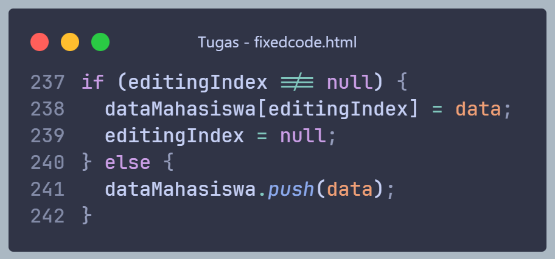

---

### 5. Bug UI: Ikon Aksi Tidak Muncul

### Masalah

Menggunakan file gambar (edit.png, trash.png) tanpa memastikan keberadaan file.

### Kode Bermasalah

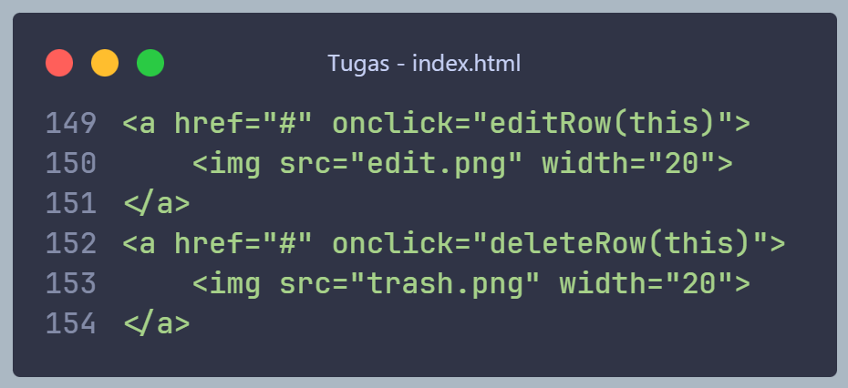

### Perbaikan

Gunakan ikon teks/emoji

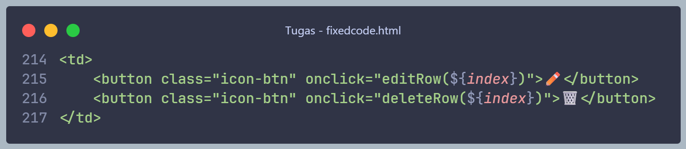

---

### 6. Bug HTML: Penggunaan < a href="#" > untuk Aksi

### Masalah

Menggunakan anchor (< a >) untuk aksi menyebabkan perilaku tidak diinginkan seperti scroll ke atas.

### Kode bermasalah

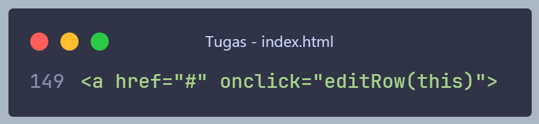

### Perbaikan

Gunakan elemen _button_

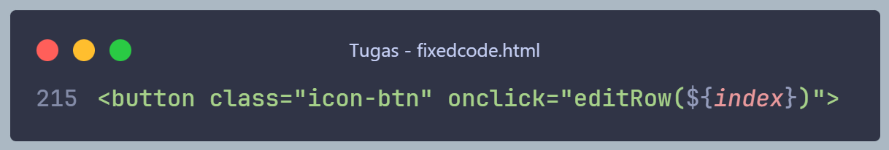

---

### 7. Bug UX: Default Tanggal Tidak Valid

### Masalah

Dropdown tanggal, bulan, dan tahun memiliki nilai default sehingga pengguna dapat mengirim data tanpa memilih secara sadar.

### Kode bermasalah

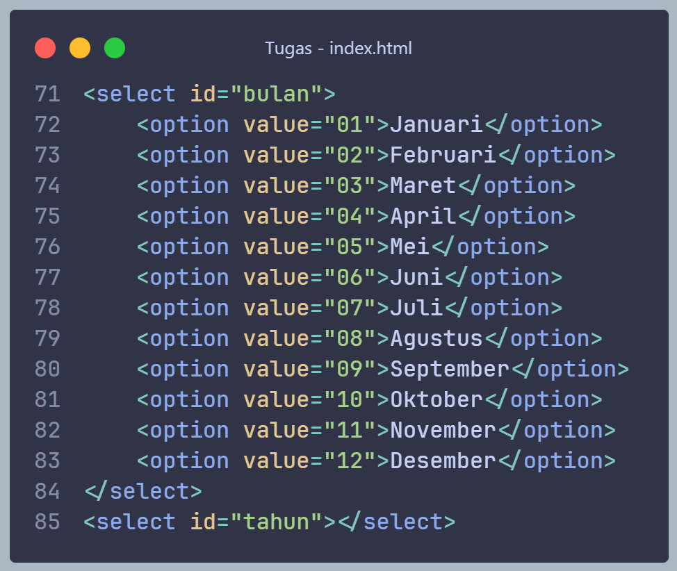

### Perbaikan

Tambahkan placeholder dan atribut _required_

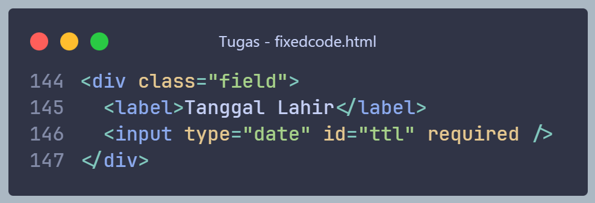

---

### 8. Bug Desain: Input Tanggal Tidak Efisien

### Masalah

Menggunakan tiga dropdown untuk tanggal lahir tidak efisien dan rawan kesalahan.

### Kode bermasalah

```
<select id="tanggal"></select>
<select id="bulan"></select>
<select id="tahun"></select>
```

### Perbaikan

Gunakan _input tanggal bawaan browser.

```
        <div class="field">
          <label>Tanggal Lahir</label>
          <input type="date" id="ttl" required />
        </div>
```
---

### 9. Bug Keamanan: Password Ditampilkan Secara Plain Text

### Masalah

Password ditampilkan secara langsung di tabel, yang merupakan praktik buruk.

### Kode bermasalah

```
<td>${password}</td>
```

### Perbaikan

Masking password.

```
const masked = "•".repeat(mhs.password.length);
```

---

### 10. Bug Maintainability: Tahun Hardcoded

### Masalah

Rentang tahun berhenti di 2025 dan tidak akan diperbarui otomatis.

### Kode bermasalah

```
    for (let i = 1990; i <= 2025; i++) {
        document.getElementById("tahun").innerHTML += `<option value="${i}">${i}</option>`;
    }
```

### Perbaikan

Gunakan tahun saat ini secara dinamis.

```
<input type="date" id="ttl" required /> 
```

---

### 11. Bug CSS: Tidak Menggunakan box-sizing

### Masalah

Padding dapat menyebabkan ukuran elemen melebihi container.

### Kode bermasalah

```
        input, textarea, select {
            width: 100%;
            padding: 8px;
            margin: 5px 0 15px;
        }
```

### Perbaikan

```
* {
    box-sizing: border-box;
  }
```

---
