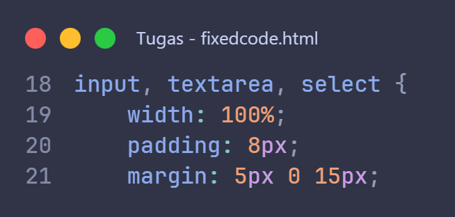
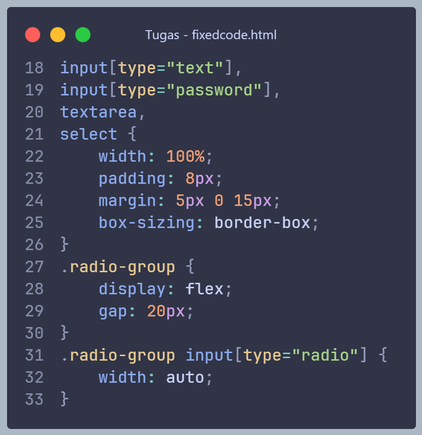

# 📌 Bugfix Pada Kode index.html

Dokumentasi ini berisi daftar bug yang ditemukan pada aplikasi serta perbaikan yang telah dilakukan untuk meningkatkan kualitas kode, tampilan, dan pengalaman pengguna.

## 🐞 Daftar Bug & Perbaikant

### 1. Bug Layout: Radio Button Tidak Tertata Dengan Benar

### Masalah

Semua elemen 'input' diberikan width: 100%, termasuk radio button. Hal ini menyebabkan radio button tampil tidak proporsional dan bergeser dari layout normal.

### Kode Bermasalah

### Perbaikan

Pisahkan styling antara input teks dan radio button.

